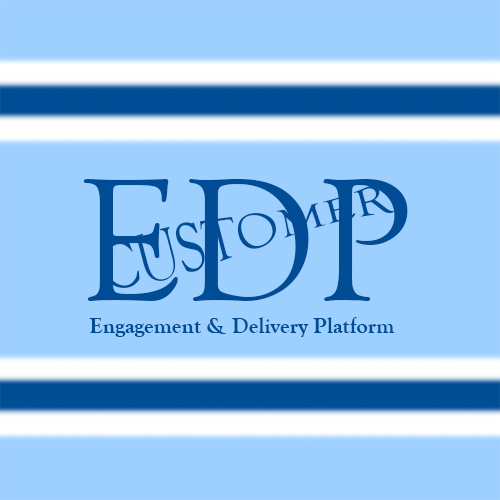

# CustomerEDP
## Customer Engagement & Delivery Platform

Polyglot Microservices project with:
- Java (Spring Boot) - Core Backend & Auth
- Python (FastAPI) - AI Intelligence
- C# (.NET) - Reporting
- React - Frontend Dashboard

## Configuration

### Database & Credentials

1. Copy `src/main/resources/application.properties.template` to `src/main/resources/application.properties`
2. Replace `YOUR_PASSWORD_HERE` with your PostgreSQL password (default: `password`)
3. Replace `YOUR_JWT_SECRET_HERE` with a secret key for JWT (e.g., `mySuperSecretKey12345678901234567890`)

### Default Admin User

The application **automatically creates** a default admin user on first startup via an internal DataLoader.

**Default credentials:**
- **Username:** `admin`
- **Password:** `admin`

> **Manual fallback (if auto-creation fails):**  
> If for any reason the admin is missing, you can insert it manually using the following SQL command inside the PostgreSQL container:
> ```sql
> INSERT INTO members (username, email, password, role, created_at) 
> VALUES ('admin', 'admin@example.com', '$2a$10$N.zmdr9k7uOCQb376NoUnuTJ8iAt6Z5EHsM8lE9lBOsl7iAt6Z5E', 'ADMIN', NOW());
> ```

## Android App

Το Android app βρίσκεται σε ξεχωριστό repository:  
[CustomerEDP-Android](https://github.com/leyterhs/CustomerEDP-Android)

### Environment Variables

1. Copy `.env.template` to `.env`
2. Replace `YOUR_PASSWORD_HERE` with your PostgreSQL password (default: `password`)

### Running the Application

1. Copy `.env.template` to `.env` and set `POSTGRES_PASSWORD`
2. Copy `src/main/resources/application.properties.template` to `src/main/resources/application.properties` and set your credentials
3. Run `docker-compose up -d`
4. Build and run the Java service:
   ```bash
   cd java-service
   mvn clean package -DskipTests
   java -jar target/java-service-0.0.1-SNAPSHOT.jar
   ```

### Running Locally (Outside Docker)

If you prefer to run the Java backend directly on your machine (e.g., for faster development):

1. Make sure the PostgreSQL container is running via `docker-compose up -d postgres`.
2. Ensure the following environment variables are set in your terminal/IDE:
   - `POSTGRES_PASSWORD` (default: `password`)
   - `JWT_SECRET` (default: `mySuperSecretKey12345678901234567890`)
3. Navigate to the `java-service` folder and run:
   ```bash
   mvn clean spring-boot:run -DskipTests
   ```

> **Note:** The local server (outside Docker) starts on port `8080`, while the Dockerized version uses port `8081` (as defined in `docker-compose.yml`).

### Running Tests
To run the unit tests for the Java backend:
```bash
cd java-service
mvn clean test
```

## API Endpoints

### Authentication
| Method | Endpoint | Description |
|--------|----------|-------------|
| POST | `/api/auth/register` | Register a new user |
| POST | `/api/auth/login` | Login and receive JWT token |

### Admin (ADMIN only)
| Method | Endpoint | Description |
|--------|----------|-------------|
| GET | `/api/admin/users` | Get all users |
| POST | `/api/admin/users` | Create a new user |
| DELETE | `/api/admin/users/{id}` | Delete a user |

### Clients
| Method | Endpoint | Description |
|--------|----------|-------------|
| GET | `/api/clients` | Get all clients |
| POST | `/api/clients` | Create a new client |
| GET | `/api/clients/{id}` | Get a client by ID |
| PUT | `/api/clients/{id}` | Update a client |
| DELETE | `/api/clients/{id}` | Delete a client |

### Engagements
| Method | Endpoint | Description |
|--------|----------|-------------|
| GET | `/api/engagements` | Get all engagements |
| POST | `/api/engagements` | Create a new engagement |
| GET | `/api/engagements/{id}` | Get an engagement by ID |
| PUT | `/api/engagements/{id}` | Update an engagement |
| DELETE | `/api/engagements/{id}` | Delete an engagement |

### Deliveries
| Method | Endpoint | Description |
|--------|----------|-------------|
| GET | `/api/deliveries` | Get all deliveries |
| POST | `/api/deliveries` | Create a new delivery |
| GET | `/api/deliveries/{id}` | Get a delivery by ID |
| PUT | `/api/deliveries/{id}` | Update a delivery |
| DELETE | `/api/deliveries/{id}` | Delete a delivery |

### AI Service (Python)
| Method | Endpoint | Description |
|--------|----------|-------------|
| GET | `/api/ai/suggest/{delivery_id}` | Get AI priority suggestion |

### Report Service (C#)
| Method | Endpoint | Description |
|--------|----------|-------------|
| GET | `/api/report/engagement/{id}` | Download PDF report for an engagement |

> **Example:** Download a PDF report for engagement with ID `1`:
> ```bash
> curl -X GET http://localhost:5000/api/report/engagement/1 -H "Authorization: Bearer <YOUR_JWT_TOKEN>" --output report.pdf
> ```
> The PDF will be saved as `report.pdf` in the current directory.

> **Note:** All endpoints except `/api/auth/register` and `/api/auth/login` require a JWT token in the `Authorization: Bearer <token>` header.

## API Documentation (Swagger)

Interactive API documentation is available via Swagger UI.

- **Local (Direct Run):** `http://localhost:8080/swagger-ui/index.html`
- **Local (Docker):** `http://localhost:8081/swagger-ui/index.html`

You can test all endpoints directly from the browser. Click the **"Authorize"** button at the top right and enter your JWT token (obtained from `/api/auth/login`) to authenticate.

## Android App

Το Android app βρίσκεται στον υποφάκελο `android-app/` (ως Git submodule):  
[CustomerEDP-Android](https://github.com/leyterhs/CustomerEDP-Android)

Για να το κατεβάσετε μαζί με το κύριο project, χρησιμοποιήστε:
```bash
git clone --recursive https://github.com/leyterhs/CustomerEDP.git
	```

### Ρυθμίσεις

1. **Android**: Άνοιξε το `android-app/gradle.properties` και όρισε το `BASE_URL`:
   - Για emulator: `BASE_URL=http://10.0.2.2:8081/`
   - Για πραγματικό κινητό: `BASE_URL=http://<YOUR_IP>:8081/`
   - Για ngrok: `BASE_URL=https://<YOUR_NGROK_URL>/`
   (Θα χρειαστεί **Build → Rebuild Project** στο Android Studio για να εφαρμοστεί).

2. **Backend (CORS)**: Άνοιξε το `application.properties` και πρόσθεσε (ή τροποποίησε) την ιδιότητα `cors.allowed.origins` ώστε να περιλαμβάνει το domain σου (π.χ. το ngrok URL σου).
   Παράδειγμα:
   ```properties
	cors.allowed.origins=http://localhost:3000,http://localhost:8080,https://tapioca-resistant-grooving.ngrok-free.dev
	```
	
### Production & UAT Environments

To run the application with UAT or Production profiles, use the provided batch scripts:

- **UAT:** `run-uat.bat`
- **Production:** `run-prod.bat`

These scripts load the respective environment files (`.env.uat` / `.env.prod`) and start the Docker containers with the appropriate configuration.

### Λειτουργίες
- **Login** με `admin` / `admin`
- **Admin Panel** – Διαχείριση χρηστών (CRUD)

